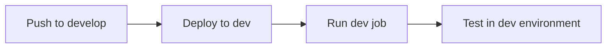

# Environment Setup Guide

This project now supports proper **Development** and **Production** environments with PR-based deployment to production.

## 🌍 Environment Overview

### **Development Environment (`dev`)**
- **Trigger**: Push to `develop` branch
- **Purpose**: Testing and development
- **Job Name**: `github_dabs_job_dev`
- **Path**: `/Workspace/Users/david.cascante@databricks.com/.bundle/github_dabs/dev`

### **Production Environment (`prod`)**
- **Trigger**: Push to `main` branch (after PR merge)
- **Purpose**: Live production deployment
- **Job Name**: `github_dabs_job_prod`
- **Path**: `/Workspace/Users/david.cascante@databricks.com/.bundle/github_dabs/prod`

## 🔄 Workflow Process

### **1. Development Workflow**


### **2. Production Workflow**


## 📋 Step-by-Step Process

### **For Development:**
1. **Create feature branch**: `git checkout -b feature/my-feature`
2. **Make changes**: Update notebooks, configurations, etc.
3. **Push to develop**: `git push origin develop`
4. **Automatic deployment**: GitHub Actions deploys to dev environment
5. **Test**: Check results in Databricks workspace

### **For Production:**
1. **Create Pull Request**: From `develop` → `main`
2. **Review**: Team reviews the changes
3. **Approve & Merge**: Merge PR to main branch
4. **Automatic deployment**: GitHub Actions deploys to production
5. **Monitor**: Check production job results

## 🛠️ GitHub Workflows

### **Development Workflow** (`.github/workflows/dev-deploy.yml`)
- **Triggers**: Push to `develop`, PR to `develop`, manual dispatch
- **Actions**: Deploy to dev environment, run dev job
- **Environment**: Development mode with prefixed resources

### **Production Workflow** (`.github/workflows/prod-deploy.yml`)
- **Triggers**: Push to `main`, manual dispatch
- **Actions**: Deploy to prod environment, run prod job
- **Environment**: Production mode with full permissions
- **Concurrency**: Only one production deployment at a time

## 🔧 Configuration Details

### **Bundle Configuration** (`databricks.yml`)
```yaml
targets:
  dev:
    mode: development
    workspace:
      host: https://adb-520209755093735.15.azuredatabricks.net
      root_path: /Workspace/Users/david.cascante@databricks.com/.bundle/github_dabs/dev

  prod:
    mode: production
    workspace:
      host: https://adb-520209755093735.15.azuredatabricks.net
      root_path: /Workspace/Users/david.cascante@databricks.com/.bundle/github_dabs/prod
```

### **Job Configuration** (`resources/github_dabs.job.yml`)
```yaml
resources:
  jobs:
    github_dabs_job:
      name: github_dabs_job_${bundle.target}  # Creates dev/prod specific names
```

## 🎯 Benefits of This Setup

1. **Environment Separation**: Clear dev/prod boundaries
2. **PR-based Production**: No direct pushes to production
3. **Testing First**: All changes tested in dev before prod
4. **Rollback Safety**: Easy to revert if issues arise
5. **Team Collaboration**: Review process for production changes
6. **Audit Trail**: Clear history of what went to production when

## 🚀 Getting Started

### **Initial Setup:**
1. **Create develop branch**: `git checkout -b develop`
2. **Push develop**: `git push origin develop`
3. **Test dev deployment**: Push changes to develop branch
4. **Create PR**: From develop to main when ready for production

### **Daily Workflow:**
1. **Work on develop branch**: Make your changes
2. **Test in dev**: Push to develop, check results
3. **Create PR**: When ready, create PR to main
4. **Review & Merge**: Team reviews, then merges to main
5. **Production Deploy**: Automatic deployment to production

## 🔍 Monitoring

### **Development Environment:**
- Check GitHub Actions for dev workflow status
- Monitor Databricks workspace for dev job results
- Look for `[dev]` prefixed resources

### **Production Environment:**
- Check GitHub Actions for prod workflow status
- Monitor Databricks workspace for prod job results
- Look for `[prod]` prefixed resources

## 🛡️ Best Practices

1. **Never push directly to main**: Always use PRs
2. **Test thoroughly in dev**: Before creating PR to main
3. **Review all changes**: Team review for production changes
4. **Monitor deployments**: Check both dev and prod results
5. **Use meaningful commit messages**: Clear history of changes

This setup ensures safe, controlled deployments with proper testing and review processes! 🎉
